## Running Docker (Mac OS X)

We assume that you have already downloaded and installed Docker Toolbox,
following the instructions on the [Docker Toolbox
Installation](https://www.docker.com/toolbox) guide. Once you have
successfully installed the Docker Toolbox, you will need to open a Docker
terminal, the easiest way to do this is to use the _Docker Quickstart
Terminal_ application. Details are included on the _Getting Started with
Docker_ [documentation](http://docs.docker.com/mac/started/), note be
sure to use the right version for your particular operating system. Once
the Docker terminal window has started, you should see a new terminal
window with a Unix shell prompt.

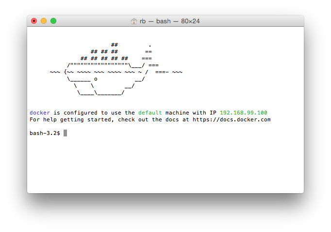

Note: If you encounter an error or have a problem with any of these
steps, you can either
- ask for help on the Moodle Q&A Forum, or
- Google for a solution.

Also, it is common for the prompt on Unix systems to end in a $
character. Thus, we indicate that the given example is a Unix command by
writing the $ symbol at the beginning. So, for example, when we indicate
to type `$ docker run hello-world`, we are actually telling you that
this is a Unix command and you have to type `docker run hello-world`
(without a `$`) at the prompt. Your actual prompt might be slightly
different, for example it might be `bash-3.2$`.

### Docker Installation test

Once the Docker terminal window has started, you should click in the
terminal window with your mouse to make the terminal window _active_. To
test your Docker installation, enter the following command in the window
(this will appear after the Unix prompt) and hit _enter_ or _return_ on
your keyboard:

```console
$ docker run hello-world
```
This is shown in the following screenshot:

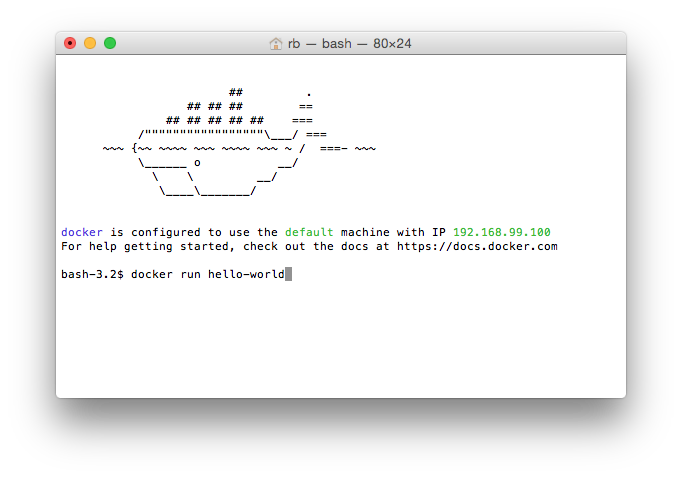

If this runs successfully, information about the Docker execution
process will appear, including a message that _your installation
appears to be working correctly:

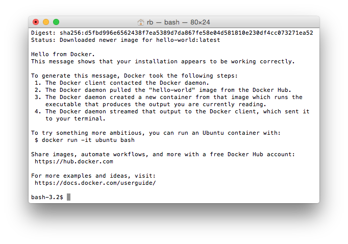
 
### INFO 490 Container

First, you need to download our INFO 490 Docker image by entering the
following command in your Docker terminal:

```console
$ docker pull lcdm/standalone-info490
```

This will pull the course Docker image, which, depending on your network
connection speed, may take a while. At the very end you should see
message indicating that the download was succesful.

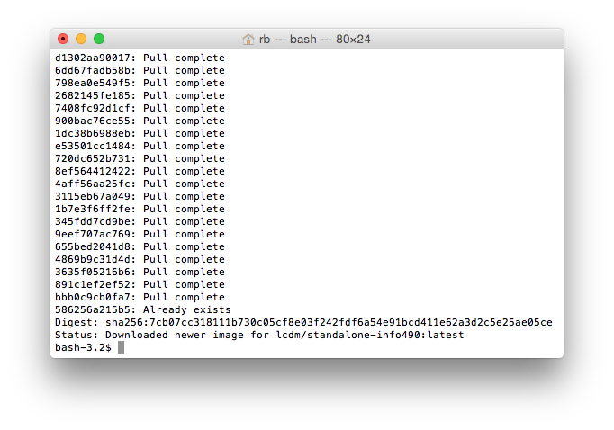

After the download process completes (with no error; if you get an
error, ask for help or google it), try the following simple test to make
sure everything is working:

```console
$ docker run lcdm/standalone-info490 /bin/echo "hello world"
```

If succesful, your command should print "hello world" on the line after
the one on which you enter the `docker run` command.

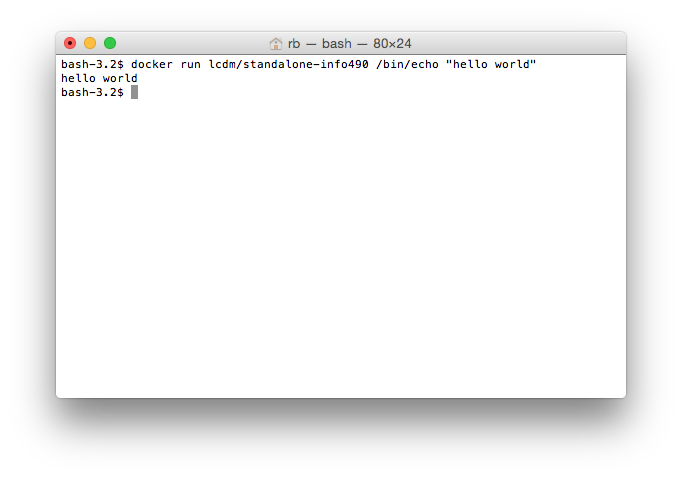

### Interactive Mode

When learning how to work at the Unix prompt, you will have two options.
The first is to run our Docker course image in interactive mode; the
second technique is demonstrated int the _Jupyter Server_ section. To
run our course Docker image in **interactive mode**, we need to use the
`-it` option:

```console
$ mkdir info490
$ docker run -it lcdm/standalone-info490 /bin/bash
data_scientist@29f407246d50:~$ echo 'hello world'
hello world
```

This demonstration consists of three commands:
1. We first create a new working directory for the course.
2. We next run our course Docker image, the command is long for several reasons:
  - the `-it` flag says run the container in **interactive mode**,
  - `lcdm/standalone-info490` is the name of our course Docker image.
  -  `/bin/bash` is the name of the program to run once our Docker
  container starts. As you will learn in Lesson 3, this is the program
  for the BASH shell, which allows you to run Unix commands.
3. Inside our course Docker container, we run the `echo` command, which
simply displays any text the follows to the command line.

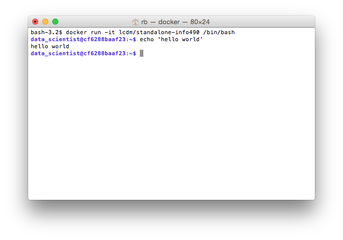

The prompt in your running course Docker container should be similar,
but will likely have a different value between the '@' character and the
':' character, which corresponds to the _hostname_ of your running
Docker container. This new prompt indicates that you are in a different
server. You can use this running container when you are trying out Unix
commands in the rest of this course. When you are done, you can exit out
of the running Docker container by entering `exit` at the Docker
container prompt:

```console
data_scientist@cf6288baaf23:~$ exit
exit
bash-3.2$ 
```

### Shared Volumes

When you execute commands inside a Docker container, the results are
isolated, by default, to that container. This is one of the primary
benefits of _virtualization_. However, we will want to save data and
programs (which you will need to submit to Moodle), which is most easily
done by [mounting a host directory as a data volume in
Docker](https://docs.docker.com/userguide/dockervolumes/).

To most easily accomplish this, we recommend the following steps.

1. Inside a Docker terminal, first ensure you are in your _Home_
directory by issuing a `cd` command at the Unix prompt.

2. Now make a new directory for this course, for example _info490_ by
using the `mkdir` command.

3. Change into this new directory by using the `cd info490` command.

4. Determine the full pathname of this directory by using the `pwd`
command.

5. Using this information, start the course Docker image by mapping this
new directory as a data volume in the running Docker course container.
The `-v` flag maps a _host_ directory to a directory inside the Docker
container. The first name is the host directory, for example
`/Users/rb/info490`, while the second name is the directory inside the
Docker container, for example `/home/data_scientist/info490`.

```console
-v /Users/rb/info490:/home/data_scientist/info490
```

Note that you will need to replace `/Users/rb/` with the output of the
`pwd` command on your host computer. In the following screenshot, we
demonstrate this mapping process:

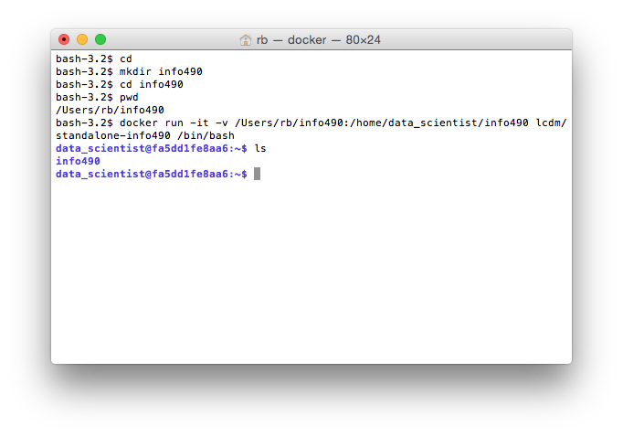

In general, you will always want to use this same flag combination when
you start a Docker image in **interactive mode** in order to be able to
reuse data or results from previous commands inside a Docker container.
As an example, we can clone our course github repository into the Docker
container:

```console
data_scientist@fa5dd1fe8aa6:~$ cd info490
data_scientist@fa5dd1fe8aa6:~/info490$ git clone https://github.com/UI-DataScience/info490-fa15.git
```

After the `git clone` command completes, exit out of the Docker
container and issue a `ls` command in the Docker terminal. You should see
`info490-fa15` displayed, which is the name of the github repository,
inside of which are the course notes.

### IPython Notebooks

We will also be using **IPython** notebooks for most of the course. The
course Docker image is designed to primarily be used as a Jupyter server,
which will allow us to dynamically interact with IPython Notebooks. The
command to run the course Docker image as a Jupyter server is slightly
more complicated since we need to specify more parameters.

so let's make sure that the notebook server is working properly. Type
(change "YourPassword" to something you would remember)

```console
$ docker run -d -p 8888:8888 -v /Users/rb/info490:/home/data_scientist/info490 lcdm/standalone-info490
```

This is demonstrated in the following screenshot. We have added one
additional command, however, `docker-machine ip default` in order to
know on which IP address our server is listening.

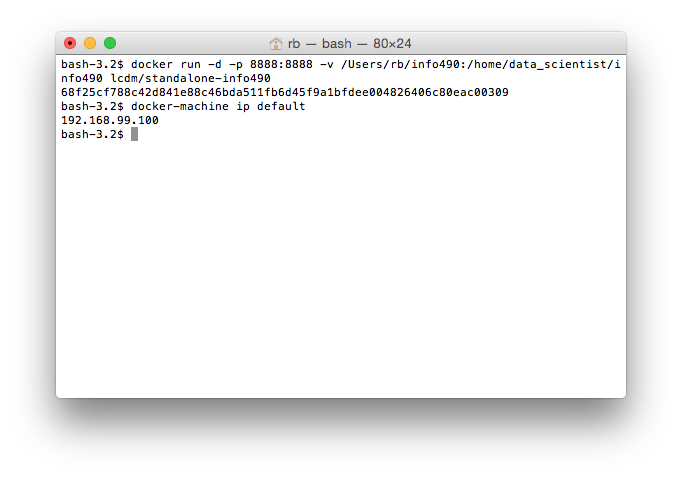

In this case, our server is running on `192.168.99.100` but your value
might be different. To connect to our running server, open up the web
browser of your choice on **host** machine and go to the IP address that
the server is running on, for example, http://192.168.99.100:8888. You
should receive a simple page that looks similar to the following
screenshot.

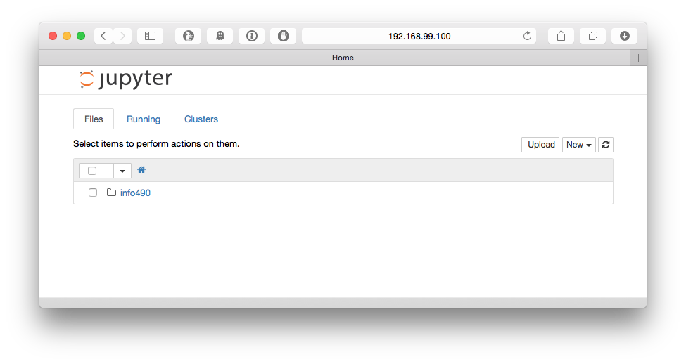

At this point you should try several things to verify everything is
working correctly. First, open a new terminal window by selecting the
_New_ menu and clicking on _Terminal_. You should have a new webpage
that contains a running Unix shell, you can also use this to learn about
Unix commands.

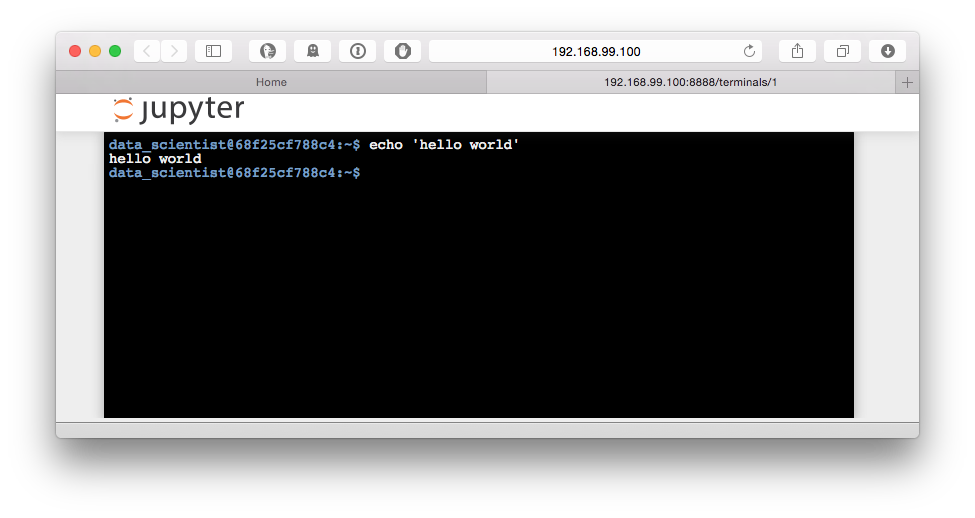

Next, go back to the Jupyter home page, and open a new IPython Notebook
by selecting the _New_ menu and clicking on _Python3_ under Notebooks.
You should now have a blank IPython Notebook. Click in the grey cell
area and enter `print('hello world')`. Next, click the right pointing
triangle in the toolbar, and you should have just run your first IPython
Notebook!

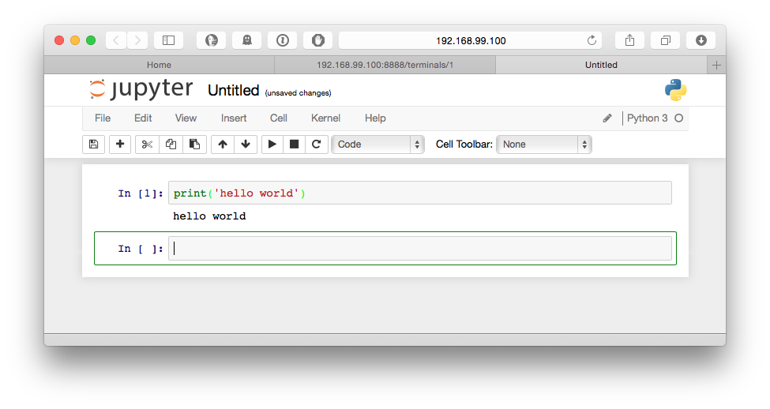

Finally, return to the Jupyter home page and navigate the course github
repository (if you did not issue the git clone command earlier you will
not see any files listed. Return to that step and clone our course git
repository inside your Docker container (you can also issue these
commands inside the Jupyter terminal window). You will likely see a new
Notebook called `Untitled.ipynb` on tis page, along with a directory
called `info490-fa15`. Click on the `info490-fa15` and navigate through
the course repository. Note that IPython Notebooks (which end in
`.ipynb`) can be run interactively. Try this out with the
`intro2github.ipynb` Notebook which is located in the _Orientation_ week.

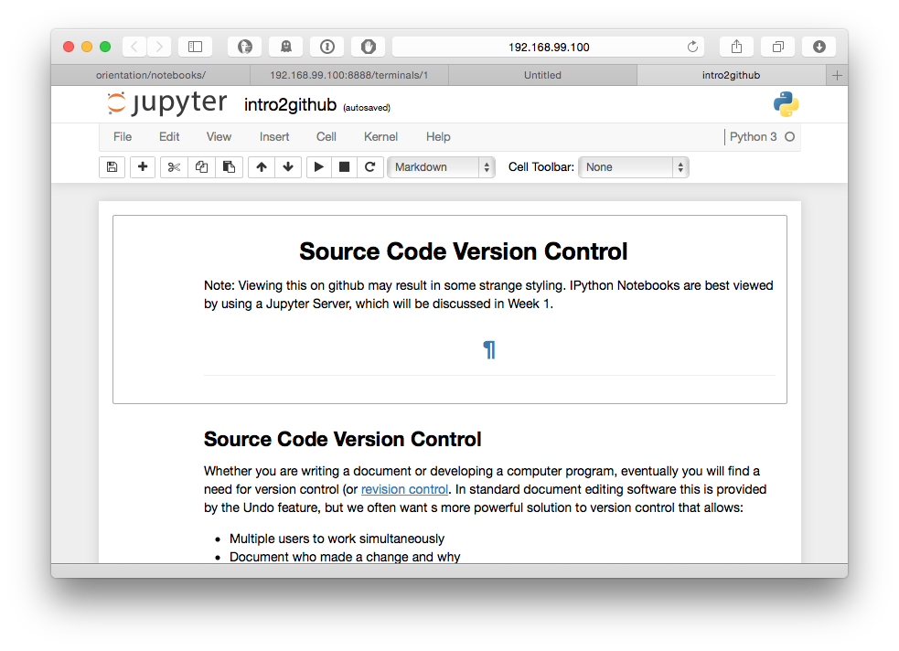

Feel free to explore, run, and change things in course notebooks. You
can always clone the course repository again, which you will need to do
anyway as we update material.

