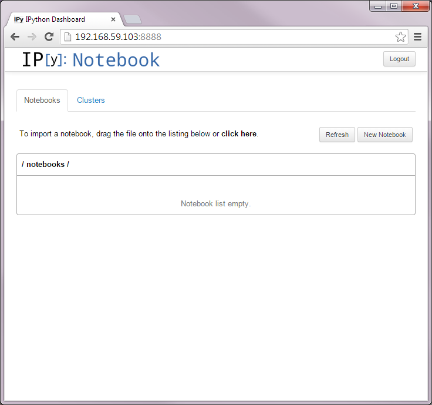
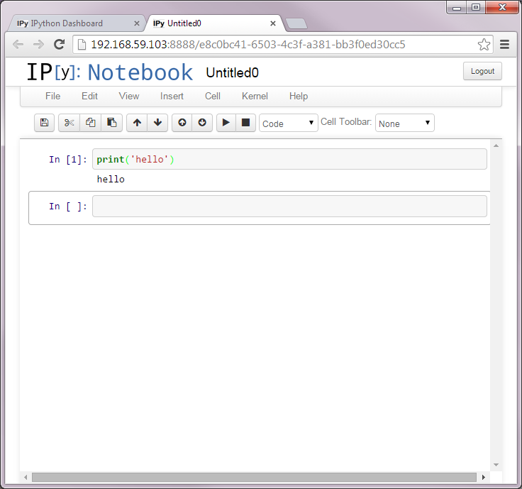

## Running Docker

First, you should definitely go though the [10-minute Docker tutorial](https://www.docker.com/tryit/). If you are not familiar with the command prompt, don't worry; we will learn the Unix command line interface (CLI) in the following weeks. Just type the commands exactly as shown in the following sections and make sure that you get the expected results.

I also highly encourage you to go through the [Docker User Guide](https://docs.docker.com/userguide/) tolearn more about Docker. In the following sections, we will install a Docker container image that is specifically built for INFO 490, and make sure that your machine can run an IPython notebook server.

### INFO 490 Container

If you are using Boot2Docker, it will log you in automatically so you can start using Docker right away, and you will see the following command prompt:

```console
docker@boot2docker:~$
```

First, download our INFO 490 Docker image by typing

```console
$ docker pull lcdm/info490
```

It is common for the prompt on Unix systems to end in a $ character. Thus, it
is common to indicate that the given example is a Unix command by writing the $
symbol at the beginning. So when I told you to type `$ docker pull lcdm/info490`, I was actually telling you that this is a Unix command and you have to type `docker pull lcdm/info490` (without `$`) at the prompt.

After the download process completes (with no error; if you get an error anywhere during this assignment, ask for help or google it), let's make sure that it works:

```console
$ docker run lcdm/info490 /bin/echo "hello world"
hello world
```

### Interactive Mode

For the first couple of weeks, you will need to enter an **interactive mode** by specifying `-it` option:

```console
$ docker run -it lcdm/info490 /bin/bash
root@0b2616b0e5a8:/# echo "hello world"
hello world
```

You can tell that you are in a different server as a different user because `username@server:directory$` (`docker@boot2docker:home$` where home is abbreviated by `~`) changed to `root@containerID:/#` (the `#` symbol indicates that you have superuser privileges; more on this later).

### IPython Notebooks

We will also be using **IPython** notebooks for most part of the course, so let's make sure that the notebook server is working properly. Type (change "YourPassword" to something you would remember)

```console
$ docker run -d -p 8888:8888 -e "PASSWORD=YourPassword" lcdm/info490
```

Now open up a web browser of your choice on your **host** machine and go to http://192.168.59.103:8888. After you enter your password, you will be able to access the notebook server.

Note: Boot2Docker usually uses the address 192.168.59.103, but it is possible
that it uses a different address. If you cannot connect to the default address,
check the ip address with

```console
docker@boot2docker:~$ ifconfig
```



Select New Notebook and an empty notebook will be created. You can test this by entering 

```python
print('hello world')
```

and pressing <kbd>shift</kbd>+<kbd>Enter</kbd>



When you are done working on your IPython notebook, save your work by selecting
File > Download as > IPython Notebook (.ipynb):


Your work will be saved on the **host** machine (not in the Docker container).

### Next Section

If you are running Boot2Docker, you need to setup [Folder Sharing](docker_folder_sharing.md) in order to save your work in the container or transfer files between the container and the host. Go to the [next section](docker_folder_sharing.md)
