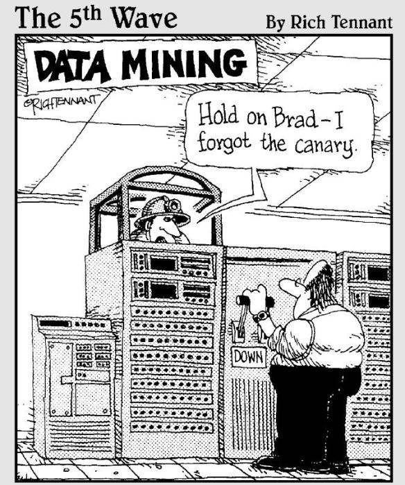

#Week 12 Overview#

## Data Exploration ##

In this week, you will learn about some basic approaches to data exploration, which is a crucial step before embarking on more complex data modeling or mining tasks. First, you will use an instructor supplied IPython Notebook to understand the challenges of working with large data, including handling excessive memory usage, limiting data rows and columns, and specifying data types to minimize data volume. Second, you will use an instructor supplied IPython Notebook to learn about visual techniques for exploring data, including pair plots, plots to compare distributions, and summary plots. Finally, you will use an online IPython Notebook to explore the statistical exploration of a data set, which will introduce you to  Monte Carlo Markov Chains (MCMC).

### Objectives ###

#####By the end of this lesson, you should accomplish the following learning objectives:######

- Understand the basic approaches to data exploration.
- Understand how to use Python and the Unix command line to explore a data set and to subset the data as necessary to improve performance.
- Understand how to visually explore a data set.
- Understand how to use MCMC to estimate model parameters for a given data set.

### Activities and Assignments ###

|Activities and Assignments | Time Estimate | Deadline* | Points|
|:------| -----|-------|----------:|
|**[Week 12 Introduction Video](https://mediaspace.illinois.edu/media/Week+Twelve/0_ll7ga29f)**|10 Minutes|Tuesday|NA|
|**[Week 12 Lesson 1: Data Preparation](lesson1.md)**| 2 Hours |Thursday| 20|
|**[Week 12 Lesson 2: Visual Exploration](lesson2.md)**| 2 Hours | Thursday | 20 |
|**[Week 12 Lesson 3: Statistical Exploration](lesson3.md)**| 3 Hours | Thursday| 70 |
|**Week 12 Quiz**| 35 Minutes | Friday | 70|
|**Week 12 Assignment**| 3 Hour | Saturday | 60 (from instructor) 40 (from peers) 50 (for completing the peer review) | 

*Please note that unless otherwise noted, the due time is 6pm Central time!

----------

Photo Credit: Data Mining by Rich Tennant. https://markjowen.wordpress.com/2010/06/03/data-mining/.  Accessed 3 August 2015.
