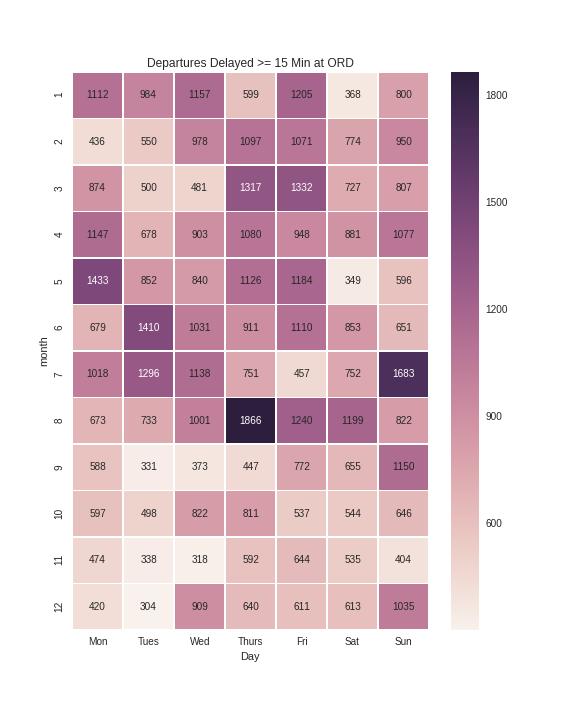

## Problem 12.2. Heat Maps

- The IPython notebook template for this problem is 
[heat_map.ipynb](http://nbviewer.ipython.org/github/EdwardJKim/info490/blob/master/week12/heat_map.ipynb).

Create a heat map that displays the **number count** of delayed flights
  at the O'Hare international airport (ORD)
  as a function of `month` and `Day`. We define a flight to be
  delayed if its departure delay is greater than or equal to
  15 minutes.




I hope you actually tried the examples in
  [lesson 1](http://nbviewer.ipython.org/github/INFO490/spring2015/blob/master/w
eek12/intro2de.ipynb)
  because you are required to use the `sflights.h5` file you have created
  as you read along the
  [lesson 1](http://nbviewer.ipython.org/github/INFO490/spring2015/blob/master/w
eek12/intro2de.ipynb)
  notebook. When we use the `sflights.h5` file, the `data` DataFrame
  looks as follows:

  ```python
  print(data.head())
  ```
  ```text
     month  Day  dTime  aDelay  dDelay depart arrive  distance
  0      1    3   1806      -3      -4    BWI    CLT       361
  1      1    4   1805       4      -5    BWI    CLT       361
  2      1    5   1821      23      11    BWI    CLT       361
  3      1    6   1807      10      -3    BWI    CLT       361
  4      1    7   1810      20       0    BWI    CLT       361

  [5 rows x 8 columns]
  ```

### Function: pivot\_table()

Write a function named `pivot_table()` that takes a DataFrame.
  It should return a DataFrame that has the **number count** of flights that
  - departed from ORD
  - had departure delays greater than or equal to 15 minutes
  as a function of `month` and `Day`.

You should also pivot the data to make the **pivot table**
  so that we can use the resulting DataFrame in `sns.heatmap()`.
  [Week 12 lesson 2](http://nbviewer.ipython.org/github/INFO490/spring2015/blob/
master/week12/dataexplore.ipynb)
  shows you how to do this.
  When I ran

  ```python
  pivoted = pivot_table(data)
  print(pivoted)
  ```

  I got

  ```text
  Day       1     2     3     4     5     6     7
  month
  1      1112   984  1157   599  1205   368   800
  2       436   550   978  1097  1071   774   950
  3       874   500   481  1317  1332   727   807
  4      1147   678   903  1080   948   881  1077
  5      1433   852   840  1126  1184   349   596
  6       679  1410  1031   911  1110   853   651
  7      1018  1296  1138   751   457   752  1683
  8       673   733  1001  1866  1240  1199   822
  9       588   331   373   447   772   655  1150
  10      597   498   822   811   537   544   646
  11      474   338   318   592   644   535   404
  12      420   304   909   640   611   613  1035

  [12 rows x 7 columns]
  ```


### Plot: sns.heatmap()

Finally, use the `pivoted` DataFrame in `sns.heatmap()`
  to create  heat map.


