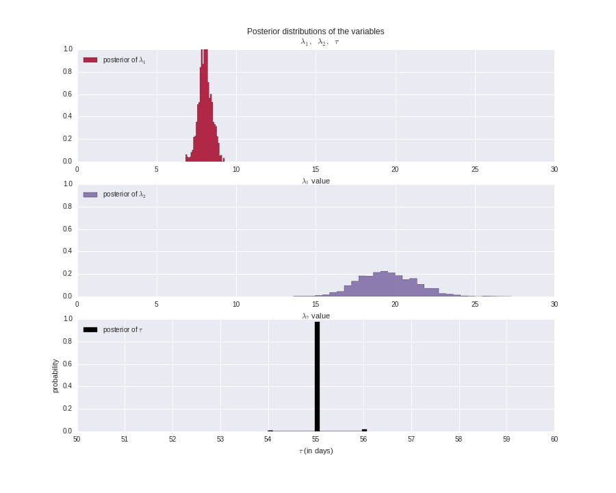
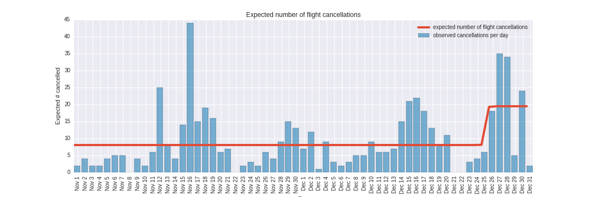

## Problem 12.3. MCMC.

- There is no template for this problem.

Use PyMC as demonstrated in
  [Chapter 1](http://nbviewer.ipython.org/github/CamDavidsonPilon/Probabilistic-Programming-and-Bayesian-Methods-for-Hackers/blob/master/Chapter1_Introduction/Chapter1.ipynb)
  of *Probabilistic Programming and Bayesian Methods for Hackers*
  to model the flight cancellation (`Cancelled == 1`) patterns
  at the O'Hare international airport (`Origin == 'ORD'`)
  from November, 2001 to December, 2001.

Note that you can use most of the code in *Probabilistic Programming and
  Bayesian Methods for Hackers* with minimal modification.
  The purpose of this problem is to force you to try the example code
  on the flights data set.

Note: It is possible that you get a different result from the
  following example (e.g. you see an increase/decrease on
  a day other than the Christmas day),
  because MCMC is a stochastic method and
  there's some inherent randomness in MCMC.
  Use the following example as a guide rather than
  try to exactly reproduce the sample plots.

When I used this DataFrame:

```python
                   Cancelled
Month DayofMonth           
11    1                    2
      2                    4
      3                    2
      4                    2
      5                    4
      6                    5
      7                    5
      8                    0
      9                    4
      10                   2
      11                   6
      12                  25
      13                   8
      14                   4
      15                  14
      16                  44
      17                  15
      18                  19
      19                  16
      20                   6
      21                   7
      22                   0
      23                   2
      24                   3
      25                   2
      26                   6
      27                   4
      28                   9
      29                  15
      30                  13
12    1                    7
      2                   12
      3                    1
      4                    9
      5                    3
      6                    2
      7                    3
      8                    5
      9                    5
      10                   9
      11                   6
      12                   6
      13                   7
      14                  15
      15                  21
      16                  22
      17                  18
      18                  13
      19                   8
      20                  11
      21                   0
      22                   0
      23                   3
      24                   4
      25                   6
      26                  18
      27                  35
      28                  34
      29                   5
      30                  24
      31                   2

[61 rows x 1 columns]
```

I was able to plot the posterior distribution of
  `lambda_1`, `lambda_2`, and `tau`:



I was also able to see a sudden change in the expected
  number of flights on the Christmas day:


