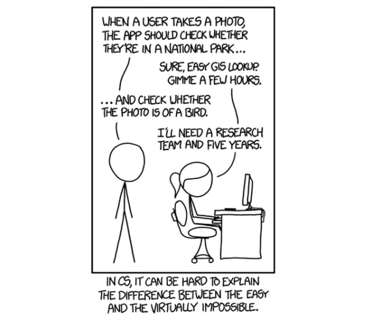

#Week 13 Overview#

## Machine Learning ##

In this week, you will learn about basic machine learning concepts, including supervised learning, unsupervised learning, dimensional reduction, and cluster finding. We will use the sickout_learn library to perform these tasks, specifically introducing the KNN, SVM, decision trees, and random forest classification algorithms, the PCA dimensional reduction algorithm, and the k-means cluster finding algorithm. 

### Objectives ###

#####By the end of this lesson, you should accomplish the following learning objectives:######

- Understand the basic principles about machine learning.
- Understand how to perform supervised learning to classify data.
- Understand how rot perform dimensional reduction by using PCA.
- Understand how to perform cluster finding by using k-means.

### Activities and Assignments ###

|Activities and Assignments | Time Estimate | Deadline* | Points|
|:------| -----|-------|----------:|
|**[Week 13 Introduction Video](https://mediaspace.illinois.edu/media/Week+Thirteen.mp4/0_7wlk1w5v)**|10 Minutes|Tuesday|NA|
|**[Week 13 Lesson 1:Supervised Learning](lesson1.md)**| 3 Hours |Thursday| 20|
|**[Week 13 Lesson 2:Dimensional Reduction](lesson2.md)**| 2 Hours | Thursday | 20 |
|**[Week 13 Lesson 3:Cluster Finding](lesson3.md)**| 2 Hours | Thursday| 70 |
|**Week 13 Quiz**| 35 Minutes | Friday | 70|
|**Week 13 Assignment**| 3 Hour | Saturday | 60 (from instructor) 40 (from peers) 50 (for completing the peer review) | 

*Please note that unless otherwise noted, the due time is 6pm Central time!

----------

Photo Credit: Tasks by Randall Munroe. http://imgs.xkcd.com/comics/tasks.png Accessed 3 August 2015.
