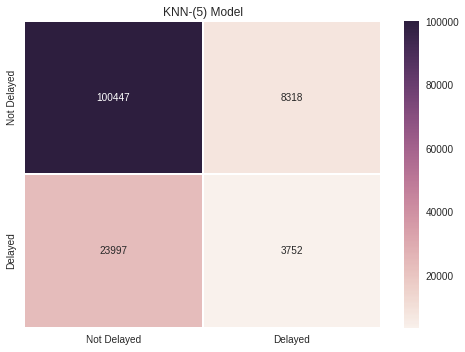
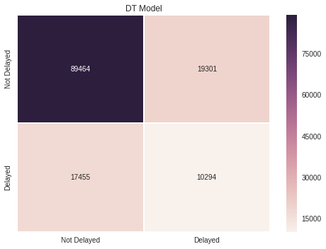

## Problem 13.1. Supervised Learning.

- The template for this problem is
  [supervised.ipynb](http://nbviewer.ipython.org/github/INFO490/spring2015/blob/master/week13/supervised.ipynb).

In this problem, we will use supervised learning techniques to
  see if we can use machine learning techniques to
  predict departure delays at the O'Hare airport (ORD).
  For simplicity, we will use only six attributes:
  `Month`, `DayofMonth`, `DayOfWeek`, `CRSDepTime`, `CRSArrTime`, and
`Distance`.
  Of the four algorithms introduced in
  [Lesson 1](http://nbviewer.ipython.org/github/INFO490/spring2015/blob/master/w
eek13/intro2dm.ipynb),
  you are only required to perform two algorithms:
  kNN and Decision Trees.
  But *scikit learn* has a unified API
  so it should be easy to test other algorithms on your own.


We use the 2001 on-time airline performance data set.
  We import the following
  [columns](http://stat-computing.org/dataexpo/2009/the-data.html):
  - Column 1: Month, 1-12
  - Column 2: DayofMonth, 1-31
  - Column 3: DayOfWeek, 1 (Monday) - 7 (Sunday)
  - Column 5: CRSDepTime, scheduled departure time (local, hhmm)
  - Column 7: CRSArrTime, scheduled arrival time (local, hhmm)
  - Column 16: DepDelay, departure delay, in minutes
  - Column 18: Distance, in miles

```python
df = pd.read_csv('/data/airline/2001.csv', encoding='latin-1', usecols=(1, 2, 3, 5, 7, 15, 16, 18))
```

We use only the flights that departed from ORD.
  We define a flight to be delayed if its departure delay
  is 15 minutes or more, the same definition used
  by the FAA (source:
  [Wikipedia](http://en.wikipedia.org/wiki/Flight_cancellation_and_delay)).


    ohare = df[df.Origin == 'ORD']
    ohare = ohare.drop('Origin', axis=1) # we don't need the Origin column anymore.
    ohare['Delayed'] = (ohare.DepDelay >= 15).astype(np.int) # 1 if a flight was delayed, 0 if not.
    ohare = ohare.drop('DepDelay', axis=1) # we don't need the DepDelay column.
    ohare = ohare.dropna()

### Function: df\_to\_array()

As explained in
  [Lesson 1](http://nbviewer.ipython.org/github/INFO490/spring2015/blob/master/w
eek13/intro2dm.ipynb),
  we need to build NumPy arrays because
  scikit-learn does not work natively with Pandas DataFrame.

- Write a function named `df_to_array()` that takes a DataFrame
  and returns a tuple of two NumPy ararys.
  The first array should have every columns and rows **except** the `Delayed`
column.
  The second array is the labels that will be used as truth values, i.e. the
`Delayed` column.


Here are some sample outputs from my code:

```python
data, labels = df_to_array(ohare)
print(data[:5])
```
```text
[[   1    1    1  951 1235  599]
 [   1    2    2  951 1235  599]
 [   1    3    3  951 1235  599]
 [   1    4    4  951 1235  599]
 [   1    5    5  951 1235  599]]
```
```python
print(labels[:5])
```
```text
[0 0 0 1 0]
```
```python
print(data.shape)
```
```text
(341284, 6)
```
```python
print(labels.shape)
```
```text
(341284,)
```

### Function: split\_train\_test()

First, we need to split our data into training testing sets. Thus,

- Write a function named `split_train_test()` function that takes two NumPy arrays.
  The first array is the attributes, and the second labels.
  It returns a tuple of four NumPy arrays:
  the training set portion of the first input array,
  the testing set portion of the first input array,
  the training set portion of the second input array,
  and the testing set portion of the second input array.

**IMPORTANT**:
  You **must** use the `random_state` parameter in the
  [`train_test_split()`](http://scikit-learn.org/stable/modules/generated/sklear
n.cross_validation.train_test_split.html)
  function to ensure
  [repeatibility](http://scikit-learn.org/stable/developers/utilities.html).
  Also, don't forget to use the optional parameter `frac`.


    from sklearn.utils import check_random_state
    random_seed = 490
    random_state = check_random_state(random_seed)

    data_train, data_test, labels_train, labels_test = split(data, labels)

### Function: learn\_knn()

- Write a function named `learn_knn()` that takes three NumPy arrays
  and an integer. The first array is the training set attributes,
  the second array is the training set labels, and
  the third array is the test set attributes.
  It should return a NumPy array that has predicted labels
  for each data point in the test set.

  There are some
  [parameters](http://scikit-learn.org/stable/modules/generated/sklearn.neighbor
s.KNeighborsClassifier.html#sklearn.neighbors.KNeighborsClassifier)
  you can adjust, but you should use **only** the `n_neighbors` parameter.

```python
labels_pred = learn_knn(data_train, labels_train, data_test, 5)
```

### Performance Metrics for kNN

There are various
  [performance metrics](http://scikit-
learn.org/stable/modules/model_evaluation.html#)
  that you can use to evaluate the performance of a classifier.
  For example, the [`score()`] method of the k-nearest neighbor classifier
  that was demonstrated in Lesson 1 computes the
  [accuracy score](http://scikit-learn.org/stable/modules/generated/sklearn.metr
ics.accuracy_score.html#sklearn.metrics.accuracy_score).

```python
from sklearn.metrics import accuracy_score
print("The accuracy score for kNN is
{0:.4f}.".format(accuracy_score(labels_test, labels_pred)))
```
```text
The accuracy score for kNN is 0.7633.
```

There are pros and cons for each metric. Another popular metrics is the
  [F1 score](http://en.wikipedia.org/wiki/F1_score).

```python
from sklearn.metrics import f1_score
print("The F1 score for kNN is {0:.4f}.".format(f1_score(labels_test,
labels_pred)))
```
```text
The F1 score for kNN is 0.1885.
````


### Plot: Confusion Matrix for kNN.

- Create a confusion matrix for the result you obtained
  from the kNN algorithm.

Here's what I got:




### Function: learn\_dt()

- Write a function named `learn_dt()` that takes three NumPy arrays:
  the attributes of training set, the labels of training set,
  and the attributes of testing set.
  It should use the decision tree algorithm
  ([`sklearn.tree.DecisionTreeClassifier`](http://scikit-learn.org/stable/module
s/generated/sklearn.tree.DecisionTreeClassifier.html#sklearn.tree.DecisionTreeCl
assifier))
  to predict what the labels for testing data are.

**IMPORTANT**:
  You **must** use the `random_state` parameter in the
  [`train_test_split()`](http://scikit-learn.org/stable/modules/generated/sklear
n.cross_validation.train_test_split.html)
  function to ensure
  [repeatibility](http://scikit-learn.org/stable/developers/utilities.html).

    labels_pred = learn_dt(data_train, labels_train, data_test)

### Performance Metrics for DT

We again compute the accuracy score for the Decision Trees classifier.

```python
print("The accuracy score for DT is {0:.4f}.".format(accuracy_score(labels_test,
labels_pred)))
```
```text
The accuracy score for DT is 0.7308.
```

And we compute the F1 score.

```python
print("The F1 score for DT is {0:.4f}.".format(f1_score(labels_test,
labels_pred)))
```
```text
The F1 score for DT is 0.3590.
```

### Plot: Confusion Matrix for Decision Trees.

- Create a confusion matrix for the result you obtained
  from the Decison Tree algorithm. Here's what what I got:




### Summary

So it seems that the decision tree classifier is better
  at predicting delays (10,294)
  than the kNN classifier (3,752).
  However, the kNN classifer classified
  more non-delays correct (100,447)
  than the decision tree classifier (89,464).

We have also seen that the kNN classifier outperforms
  the DT in accuracy score, while the F1 score of DT
  is higher than that of kNN. In our case, one classifier
  did not clearly outperform another, and which classifier
  to use would depend on specific use cases, e.g.
  if we give more weight to the correct prediction of
  non-dalays vs. delays.


    
