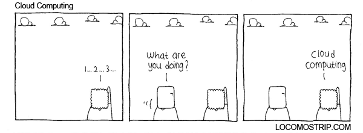

#Week 14 Overview#

## Introduction to Cloud Computing ##

In this week, you will learn about the cloud computing paradigm. First, you will learn more about Docker images and containers and how they can be deployed in a cloud computing framework. Second, you will learn how to use the Google Compute Engine, including how to specifically deploy our course Docker image within the Google Compute Engine. Finally, you will learn about Hadoop, HDFS, and how to write and deploy a map-reduce task within Hadoop.

### Objectives ###

#####By the end of this lesson, you should accomplish the following learning objectives:######

- Understand the basic cloud computing paradigm.
- Understand how to use Google Compute Engine
- Understand how to deploy and run a Docker image within Google Compute Engine
- Understand Hadoop and HDFS

### Activities and Assignments ###

|Activities and Assignments | Time Estimate | Deadline* | Points|
|:------| -----|-------|----------:|
|**[Week 14 Introduction Video](https://mediaspace.illinois.edu/media/Week+Fourteen.mp4/1_1mec91zu)**|10 Minutes|Tuesday|NA|
|**[Week 14 Lesson 1: Introduction to Cloud Computing](lesson1.md)**| 3 Hours |Thursday| 20|
|**[Week 14 Lesson 2: Running Containers in the Cloud](lesson2.md)**| 2 Hours | Thursday | 20 |
|**[Week 14 Lesson 3: Introduction to Hadoop](lesson3.md)**| 2 Hours | Thursday| 70 |
|**Week 14 Quiz**| 35 Minutes | Friday | 70|
|**Week 14 Assignment**| 3 Hour | Saturday | 60 (from instructor) 40 (from peers) 50 (for completing the peer review) | 

*Please note that unless otherwise noted, the due time is 6pm Central time!

----------

Photo Credit: Cloud Computing by Ibnu Lukman. Created 14 May 2010. http://locomostrip.com/comic/66/. Accessed 3 August 2015
