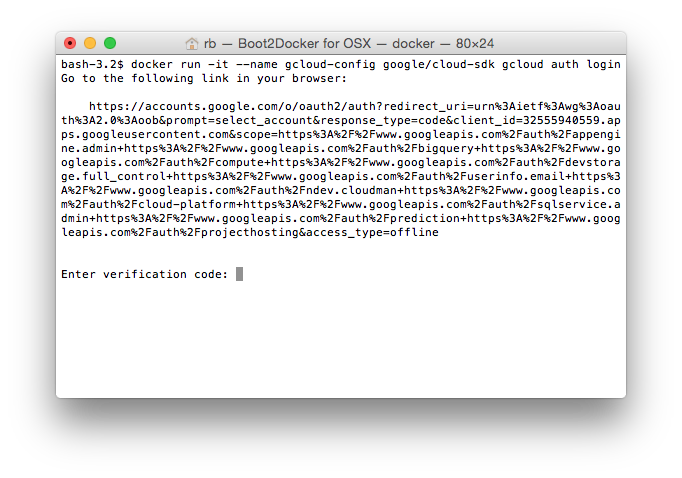
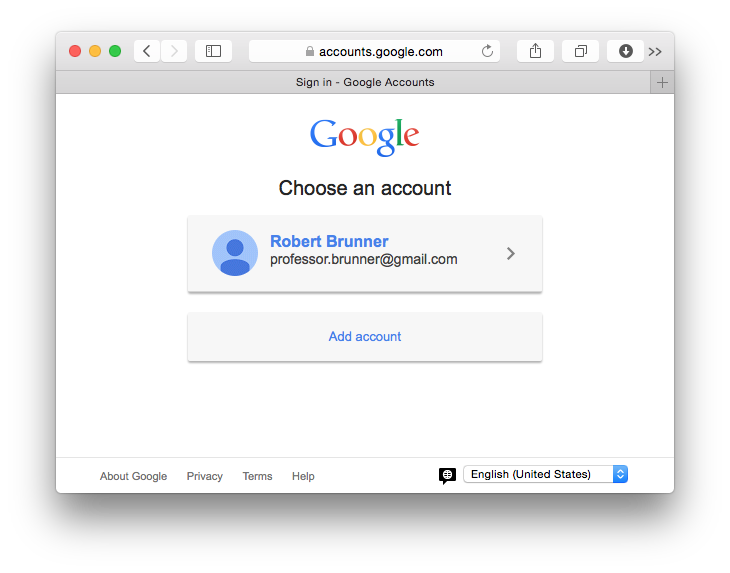
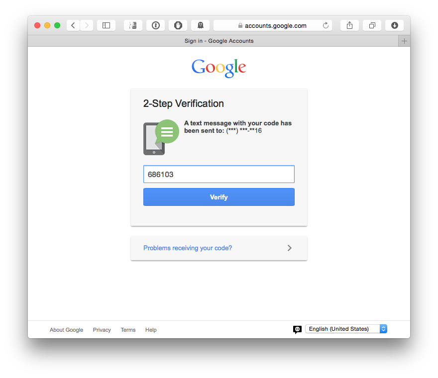
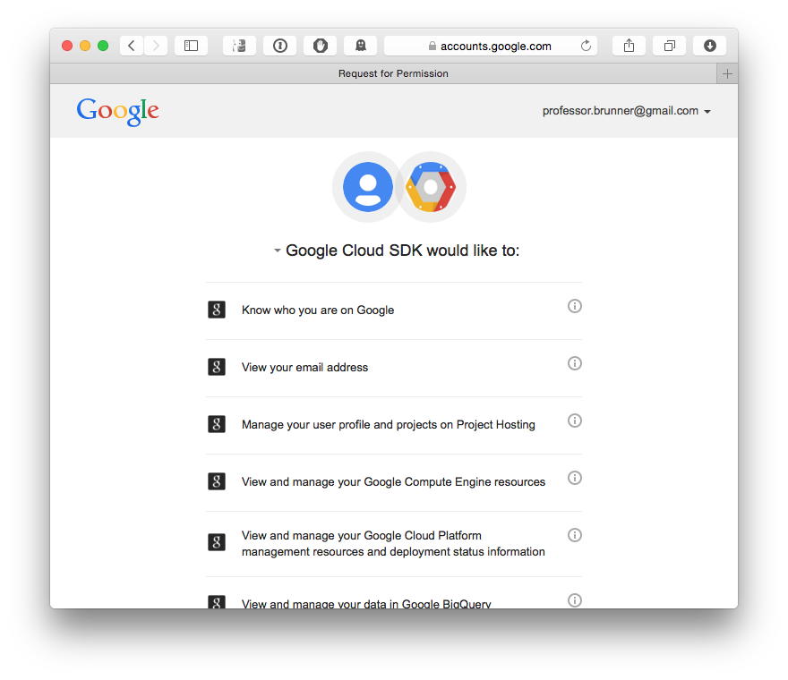
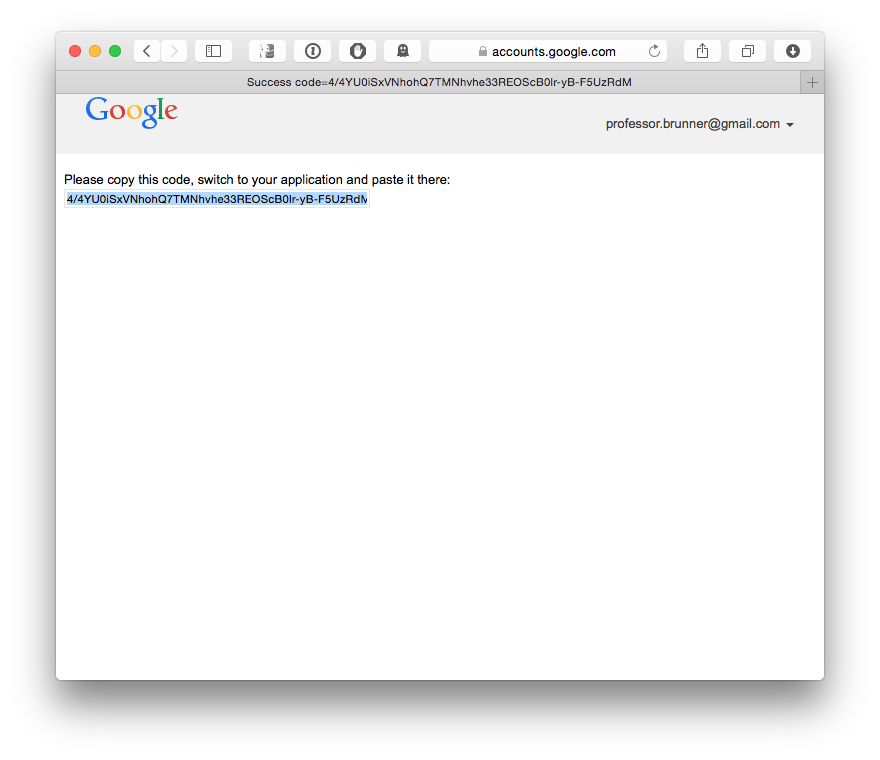
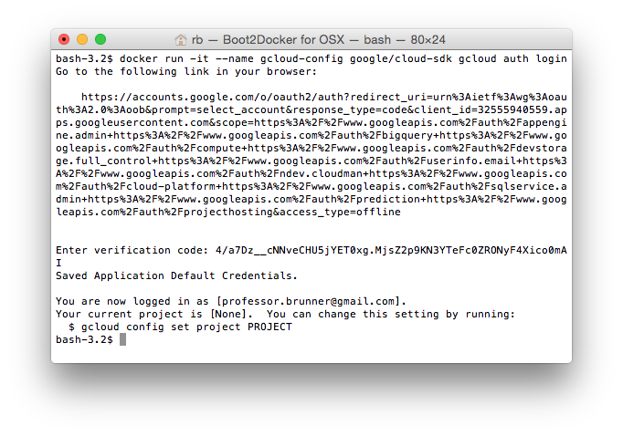
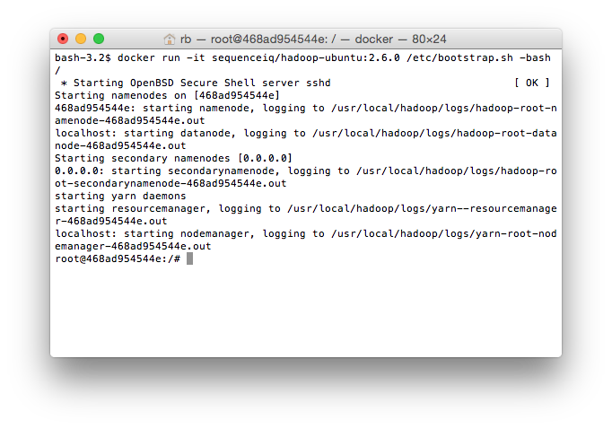

# Week 14: Cloud Computing
## Professor Robert J. Brunner 
## Getting Started

This week we will explore high performance computing with Python, including the use of cloud computing and Hadoop Streaming. To accomplish this, you should perform these operations prior to the start of class.

1. Download the Google Cloud SDK Docker image.
2. Register to use Google Compute Engine.
3. Download the SequenceIQ Hadoop Docker image.

The first two operations are detailed in the Google Cloud SDK section below. Following that are instructions for obtaining the SequenceIQ Hadoop Docker image.

-----

## Google Cloud SDK

To use the Google compute engine, you first need to have google credentials that you are willing to use for authentication. This effectively is a Google account (for example, if you have a Google email account). If you do not have a Google account, you will need to [create one](https://accounts.google.com/SignUp?hl=en). If you already have a Google account, you can use it or create a new one for this class demonstration.

Second, you need to have the Google Cloud SDK installed on your local machine so that you can connect to a running virtual machine instance within the google cloud. There are several ways to accomplish this, but to simplify the steps for our class (given your heterogenous computing laptops) we will use the official Google Cloud SDK docker image. This simply means you need to first start boot2docker and then download the appropriate image:

    docker pull google/cloud-sdk

After the image successfully downloads, you will need to run the following docker command to start the cloud-sdk image. 

    docker run -it --name gcloud-config google/cloud-sdk gcloud auth login

Note that the container will run, but not provide you with a prompt. Instead you will send the running cloud-sdk container commands by using the docker `--volumes-from` attribute to name the container that holds the relevant Google Cloud SDK information.

When this command is run you will be presented with a long URL in the terminal window, as shown in the figure below. You need to copy this URL, open a Web browser window, and paste this URL into the Web browser.

At this point, Google will ask you to indicate which account to use. If you have multiple accounts, they will be listed (for example, if multiple people have logged in to Google on your computer). Otherwise, you will be presented with your primary account. For me this is professor.brunner@gmail.com as shown below.

Note, you might be asked to perform a two-step verification, such as enter a code that is texted to your primary phone. For example, in the following image, I was asked for the code that was sent to my phone listed with my Google account.

Once you have signed in to your Google account, you will be asked to allow the Google Cloud SDK to have access to your information, the start of the page is shown below. Scroll to the bottom of this page and (assuming you are OK with this) click `Accept`. 

You will now be presented with the Google verification code on an otherwise empty Webpage. For example, my verification code Webpage is shown below.

Copy this code and switch back to your running Google Cloud SDK Docker container. Paste the code into the space following the prompt and hit 'return'.

At this point you have successfully assigned your credentials to the Google Cloud SDK and you should have a working Google Cloud SDK Docker container, as shown in the following screenshot. We can reuse this container (you might need to reauthorize it if the boot2docker virtual machine is restarted) in class to connect to a running Virtual Machine in the Google cloud.

-----

## SequenceIQ Hadoop Docker Image

We also will explore using the SequenceIQ Hadoop Docker image to perform a simple Hadoop Streaming programming example. The only required step before class is to download the Sequence Hadoop Docker image to your host machine. While we could upload this image directly to a Google compute engine, I think it will be simpler (and easier in the future for you) to download the image to your local computer. First, start Boot2docker and then enter the following command:

    docker pull sequenceiq/hadoop-ubuntu:2.6.0

This will pull an ubuntu Docker image that has the basic Hadoop v2.6 installed. If you have used Hadoop before and want to experiment with this (single-node) Hadoop instance, you can start the container with the following command:

    docker run -it sequenceiq/hadoop-ubuntu:2.6.0 /etc/bootstrap.sh -bash

This will define `$HADOOP_PREFIX` and set up the Hadoop environment for proper execution, as shown in the following screenshot.

-----

## Assignment

- [Problem 1](p1.md): Google Compute Engine.
- [Problem 2](p2.md): MapReduce.
- [Problem 3](p3.md): Hadoop.
