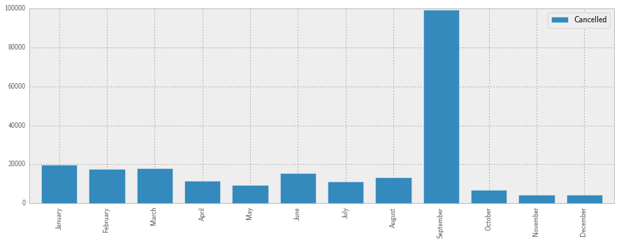

## Problem 6.2. Flight Cancellations by Month.

- The template for this problem is [cancelled.ipynb](cancelled.ipynb).

In this problem, you will use Panda's
  [`groupby()`](http://pandas.pydata.org/pandas-docs/stable/groupby.html)
  and
  [`aggregate()`](http://pandas.pydata.org/pandas-docs/stable/groupby.html)
  functions to compute and plot the number of flight cancellations
  in each month of 2001.



### get\_month\_cancelled()

First, write a function named `get_month_cancelled()`
  that takes a filename (str) and returns a `pd.DataFrame`
  that is indexed by the **names** of the months
  and has only one column `Cancelled`,
  the number of flight cancellations in each month.

- Don't forget to set the `encoding` option.
- Again, if you try to read in all 29 columns, your code will be very slow.
  Use `usecols` to read only two columns, `Month` and `Cancelled`.
- If you don't set the indices, they will be just numbers, e.g. 0, 1, 2...
  Use the following list to set the indices.
  (Copy/paste (rather than type) since even a single typo will
  cause problems for autograding.)

  ```python
  ['January', 'February', 'March', 'April', 'May', 'June',
   'July', 'August', 'September', 'October', 'November', 'December']
  ```

- When you call `get_month_cancelled('2001.csv'),
you should get the following DataFrame.

                   Cancelled
        January        19891
        February       17448
        March          17876
        April          11414
        May             9452
        June           15509
        July           11286
        August         13318
        September      99324
        October         6850
        November        4497
        December        4333

        [12 rows x 1 columns]

