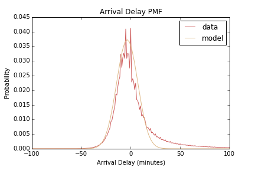
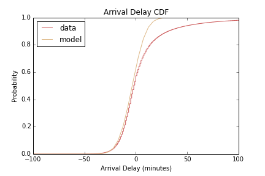

## Problem 6.3. Cumulative Distribution Function.

- The template for this problem is [cdf.ipynb](cdf.ipynb).

In this problem, you will compute and plot
  the cumulative distribution function (CDF) of arrival delay.

### Probability Mass Function

Here, we are interested in the distribution of arrival delay.
The following plot shows the PMF of arrival delay in minutes.

You don't have to make this plot.

You don't have to make this plot.

I've also fit a Guassian curve to this distribution,
which seems to fit the distribution quite well
(except at the high end).

But parts of this figure are hard to interpret
due to spikes.
Also, the shape of PMF depends a lot on the size of the bins.
That's why you are not required to create this plot;
it can be tricky to get the size of the bins right.
And the curve fitting depends on binning,
not to mention you didn't learn
[curve\_fit()](http://docs.scipy.org/doc/scipy/reference/generated/scipy.optimize.curve_fit.html)
in the lessons.

The CDF avoids these problems.

### CDF

Write a function named `get_cdf()` that takes an array and
  returns a tuple that represents the *x* and *y* axes of the (empirical) CDF.
    
Here is a very easy algorithm to implement this function.
  See the definition of
  [empirical distribution function](http://en.wikipedia.org/wiki/Empirical_distribution_function)
  on Wikipedia.
  That means we can do the following to produce the empirical CDF:

1. Use Pandas to read the specified column.
2. Pandas will automatically replace missing values `'NA'` with
   `numpy.nan` (Not A Number).
   Use
   [`numpy.isfinite()`](http://docs.scipy.org/doc/numpy/reference/generated/numpy.isfinite.html)
   to mask out these missing values.
3. Use
   [`numpy.sort()`](http://docs.scipy.org/doc/numpy/reference/generated/numpy.sort.html)
   to sort the array (with no missing values) in ascending order.
   This will be our *x*-axis.
4. Create an array of 1/*N*, 2/*N*, ..., *N*,
   where *N* is the length of the sorted array (the *x*-axis).
   This will be our *y*-axis.
   All you have to do is use `np.arange()` to make an array
   of length *N*,
   and divide each element by *N*.

According to Wikipedia, the resulting empirical CDF is an unbiased estimator for the true CDF.

Note: Do NOT use numpy.histogram() function to create a CDF.  It uses binning, which might be useful in other cases but not in this case.  The method I outlined above is a better characterization of the true CDF.

Next, use the `get_cdf()` function to create a CDF plot.
  Your plot should show both the empirical CDF calculated
  from `ArrDelay` column of `2001.csv` file
  and the CDF of a Guassian distribution.
  You can obtain the CDF of a Guassian distribution by using
  [`scipy.stats.norm.cdf()`](http://docs.scipy.org/doc/scipy/reference/generated/scipy.stats.norm.html).
  Use `loc=-3.5` and `scale=10.7`
  (which were obtained by fitting a Gaussian curve on the PDF).

