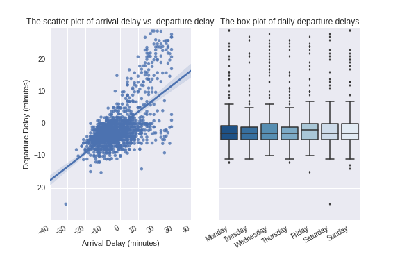

## Problem 7.3. Linear Models.

- There is no template for this problem.
- Rename your file to `FirstName_LastName_lmplot.ipynb`
  and submit it via Moodle.
- In this problem, you will use *Seaborn* to plot a regression line
  in a scatter plot and create a box/violin plot.

Using the airline on-time performance data set `2001.csv`,
  pick any two columns that you think are correlated.
  Use `sns.lmplot()` or `sns.regplot()` to create a scatter plot
  of the two columns you've chosen.
  You should also identify and compare two or more distributions,
  and use `sns.boxplot()` or `sns.violinplot()`
  to create a box/violin plot of the distributions you've chosen.

Here's an example:

Note: This plot is just an example, not the answer. Your plot may look
different. I repeat, you should not try to make your plot look exactly the same
as my plot.
