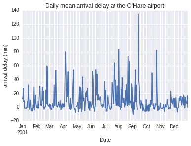
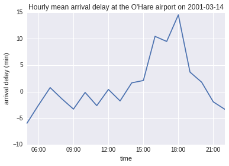

## Problem 8.1. Delays at the O'Hare Airpot.

- The template for this problem is [ord_series.ipynb](ord_series.ipynb).
- When you are done, rename your file to `FirstName_LastName_ord_series.ipynb`
  and submit it via Moodle.
- In this problem, you will use Pandas time series functionality
  to generate sequences of dates from the scheduled departure time at the
  O'Hare airport
  and do a time-series analysis of expected arrival delay.

### Function: get\_ord\_arr\_delay()

- Write a function named that takes a Pandas DataFrame object,
  which has `Year`, `Month`, `DayofMonth`, `CRSDepTime`, `Origin`, and
  `ArrDelay` columns.
  The function should return a Pandas Series object of `ArrDelay` at the
  O'Hare airport (ORD) that
  has the schedule departure time (Year + Month + DayofMonth +
  `CRSDepTime`) as Pandas DateTimeIndex.
        
To create the `DatetimeIndex` for Pandas objects, you can either
  use [`datetime` module](https://docs.python.org/3.4/library/datetime.html)
  or use [Pandas `to_datetime`](http://pandas.pydata.org/pandas-docs/dev/generated/pandas.tseries.tools.to_datetime.html).
  The latter link has some useful examples at the bottom of the page.
                
You should use all of `Year`, `Month`, `DayofMonth` and `CRSDepTime` columns
  in the 2001 flights data to create the index.
                    
Don't forget that the `ArrDelay` column may have some missing values,
  which you should remove.

In the end, you should get

```python
>>> print(get_ord_arr_delay(df, 'ORD'))
Date
2001-01-01 09:51:00    -9
2001-01-02 09:51:00    -6
2001-01-03 09:51:00    34
2001-01-04 09:51:00    18
2001-01-05 09:51:00   -10
2001-01-06 09:51:00   -14
2001-01-07 09:53:00     1
2001-01-08 09:53:00    -1
2001-01-09 09:53:00   -20
2001-01-10 09:53:00   -17
2001-01-11 09:53:00    -9
2001-01-12 09:53:00   -15
2001-01-13 09:53:00   -16
2001-01-14 09:53:00     4
2001-01-15 09:53:00    -6
...
2001-12-16 16:10:00    23
2001-12-17 16:10:00    78
2001-12-18 16:10:00    -1
2001-12-19 16:10:00     5
2001-12-20 16:10:00    -8
2001-12-21 16:10:00    11
2001-12-22 16:10:00    34
2001-12-23 16:10:00    27
2001-12-25 16:10:00    12
2001-12-26 16:10:00    15
2001-12-27 16:10:00    -6
2001-12-28 16:10:00     0
2001-12-29 16:10:00     7
2001-12-30 16:10:00     5
2001-12-31 16:10:00   -13
Name: ArrDelay, Length: 321784
```

### The Plot of Daily Arrival Delay

- Use the `get_daily_delay` function to create a plot of daily
  mean arrival delays at the O'Hare airport.

Here's an example:



### Function: get\_hourly\_delay()

- Write a function named `get_hourly_delay()` that takes a Pandas Series
  and a date in string format `'YYYY-MM-DD'`,
  and returns the **hourly means** of the column on the specified date.
      
  In the end, you should get

```python
>>> print(get_hourly_delay(arr_delay, '2001-03-14')
Date
2001-03-14 05:00:00    -6.000000
2001-03-14 06:00:00    -2.553846
2001-03-14 07:00:00     0.756098
2001-03-14 08:00:00    -1.354430
2001-03-14 09:00:00    -3.303571
2001-03-14 10:00:00    -0.155172
2001-03-14 11:00:00    -2.647887
2001-03-14 12:00:00     0.407407
2001-03-14 13:00:00    -1.762500
2001-03-14 14:00:00     1.653846
2001-03-14 15:00:00     2.100000
2001-03-14 16:00:00    10.436364
2001-03-14 17:00:00     9.477273
2001-03-14 18:00:00    14.500000
2001-03-14 19:00:00     3.684211
2001-03-14 20:00:00     1.779412
2001-03-14 21:00:00    -1.941176
2001-03-14 22:00:00    -3.357143
Freq: H, Name: ArrDelay, dtype: float64
```

### The Plot of Hourly Arrival Delay

- Pick any day you wish, and use the `get_hourly_delay` function to
  create a plot of hourly mean arrival delays at the O'Hare airport
  on that date.

Here's an example:


