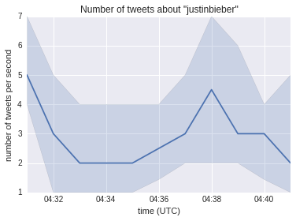

## Problem 8.2. Twitter Time Series.

- The IPython notebook template for this problem is
  [twitter_series](twitter_series.ipynb).
- When you are done, rename your file to
  `FirstName_LastName_twitter_series.ipynb` and submit it via Moodle.
- In this problem, you will use a real-time stream of tweets
  to track the number of tweets that contain your query phrase.

### Create a Twitter API Connection

First, You have to get Twitter OAuth credentials and obtain API access
  at https://dev.twitter.com/apps/new as detailed in Chapter 1 of
  Mining the Social Web 2nd Edition by Matthew A. Russell
  (hereafter referred to as simply the book),
  and fill in your OAuth credentials in place of the empty
  strings.
  See https://dev.twitter.com/docs/auth/oauth for more information
  on Twitter's OAuth implementation.

```python
CONSUMER_KEY = ''
CONSUMER_SECRET = ''
OAUTH_TOKEN = ''
OAUTH_TOKEN_SECRET = ''

auth = twitter.oauth.OAuth(OAUTH_TOKEN, OAUTH_TOKEN_SECRET,
                           CONSUMER_KEY, CONSUMER_SECRET)
```

The search API (`twitter.Twitter` connector) described in Chapter 1
  of the book is easy to use, but the data you get from the search API
  can be delayed by minutes or even hours.
  But when you want to do a time-series analysis using a *real-time* stream
  of tweets, you can use the streaming API (`twitter.TwitterStream` connector)
  instead.  Note that the streaming data is a 1% random subsample of all tweets
  available. Similar to the search API `twitter.Twitter`,
  the streaming API `twitter.TwitterStream` takes the same
  `twitter.oauth.OAuth` object.

```python
twitter_api = twitter.TwitterStream(auth=auth)
```

### Function: get\_time\_series\_data()

This function is provided for you in the template.

Try a search query and replace the file path if necessary.
  Run it, and grab a snack or study the `get_time_series_data()` function, as
  it may take up to 10 minutes.
  I repeat, do not stop this cell. It takes up to 10 minutes.

After about 10 minutes, the result will be saved to the file named
  `<query>.json`.

```python
with open(os.path.join(fpath, '{0}.json'.format(q)), 'r') as f:
    tweets = json.load(f)
```

If you read the book, you know that `tweets` returned from
  `get_time_series_data()` function
  is a list of dictionaries that contains all the metadata from every tweets we
  fetched.
  You can check this by doing `print(tweets)`, `print(type(tweets))`, and/or
  `print(type(tweets[0]))`.
      
### Function: get_created_at()

Now your task is to

- write a function that takes a list of dictionaries
  (`tweets` or Twitter statuses) and returns a `pandas.Series` object.
    
Each status is a dictionary and has the key `created_at`.
For example, `print(tweets[0]['created_at']` for my data set says
    
    Fri Mar 06 04:31:26 +0000 2015
            
You should use this `created_at` time to create each `DatetimeIndex`
  for `pd.Series`.

In the end, you should return a `pd.Series` with the
  number of tweets created at **each second**.

```python
>>> print(get_created_at(tweets))

2015-03-06 04:31:26    4
2015-03-06 04:31:27    5
2015-03-06 04:31:28    4
2015-03-06 04:31:29    4
2015-03-06 04:31:30    4
2015-03-06 04:31:31    7
2015-03-06 04:31:32    6
2015-03-06 04:31:33    8
2015-03-06 04:31:34    2
2015-03-06 04:31:35    7
2015-03-06 04:31:36    8
2015-03-06 04:31:37    5
2015-03-06 04:31:38    5
2015-03-06 04:31:39    6
2015-03-06 04:31:40    6
...
2015-03-06 04:41:22    1
2015-03-06 04:41:23    1
2015-03-06 04:41:24    2
2015-03-06 04:41:25    1
2015-03-06 04:41:26    5
2015-03-06 04:41:27    0
2015-03-06 04:41:28    1
2015-03-06 04:41:29    3
2015-03-06 04:41:30    0
2015-03-06 04:41:31    3
2015-03-06 04:41:32    4
2015-03-06 04:41:33    1
2015-03-06 04:41:34    2
2015-03-06 04:41:35    2
2015-03-06 04:41:36    2
Length: 611
```

Note that you will get different times and numbers.
  And if there was no tweet at a particular second in time,
  the count should be zero.

### Plot

Finally, you should

- plot the **median** (the 50th percentile)
  number of tweets in a certain time interval.
    
An interval of 60 seconds seems reasonable,
  but you should choose an interval that is most appropriate for your data
  set. You should also
          
- draw confidence bands based on the 16th and 84th percentiles
  (a 68% or one standard deviation level of confidence).

You can do this by using
  [pandas.Series.resample](http://pandas.pydata.org/pandas-docs/dev/generated/pandas.Series.resample.html)
  to redefine the time interval of your time series data.
  Note that the `how` parameter can be a list or a dictionary.
  For our purposes, you can use the following:
                    
```python
how={'50th percentile': np.median,
'16th percentile': lambda x: np.percentile(x, 16),
'84th percentile': lambda x: np.percentile(x, 84)}
```

If you provide multiple functions in the `how` parameter,
  the `resample()` method will return a dataframe.
  You can use the `16th percentile` and `84th percentile` columns
  of this dataframe in the
  [`fill_bewteen()` function](http://matplotlib.org/users/recipes.html#fill-between-and-alpha)
  to draw the confidence band. Here's an example plot:



Note: Your plot will look different but it should have the confidence band.
