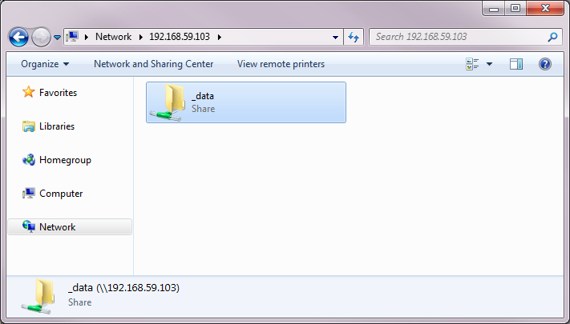

## Folder Sharing

### Windows and Mac OS X

If you are using Boot2Docker on Windows or Mac OS X, you will need to set up folder sharing to share disk space between your local desktop and a Docker container. You may postpone this until the end of the first week when you will be more familiar with the Unix CLI, but keep in mind that you will need to use this feature at some point.

First, make a volume container by typing (you only need to do this once)

```console
$ docker run -v /data --name my-data busybox true
$ docker run --rm -v /usr/local/bin/docker:/docker -v /var/run/docker.sock:/docker.sock svendowideit/samba my-data
```

We will connect to the Docker container using the IP address of your
Boot2Docker host, which is 192.168.59.103 by default. On Windows, use Explorer
to connect to

    \\192.168.59.103

and the shared folder should appear as either `data` or `_data`.



On Mac OS X, you can find out the IP address of your Boot2Docker host with

```console
$ boot2docker ip
192.168.59.103
```

and connect to the shared folder using Finder (OS X):

    Connect to cifs://192.168.59.103/data

Once mounted, it will appear as "/Volumes/data".

You can then use your data container from any container you like. For
interactive mode, you would type

```console
$ docker run -it --volumes-from my-data lcdm/info490 /bin/bash
```

You can make sure that the data container is mounted correctly by typing the following in your container:

```console
root@58c532684e57:/notebooks# cd /data
root@58c532684e57:/data# touch hello
```

and a file named "hello" should appear in the "data" folder of your Explorer window.

And to run the IPython notebook server with our data container, type

```console
$ docker run -d -p 8888:8888 -e "PASSWORD=YourPassword" --volumes-from my-data lcdm/info490
```

Note: If you are still running a notebook server from the previous section, you will see an error, and you will need to stop the previous notebook server. List docker containers by typing:

```console
$ sudo docker ps -a
CONTAINER ID        IMAGE                    COMMAND             CREATED             STATUS              PORTS                    NAMES
c693f2078b1e        lcdm/info490:latest   "/notebook.sh"      19 seconds ago      Up 18 seconds       0.0.0.0:8888->8888/tcp   agitated_carson
```

The notebook server's COMMAND is "/notebooks.sh" and its PORTS shows
"8888->8888". Stop and delete this container by using its name:

```console
$ docker stop agitated_carson
$ docker rm agitated_carson
```

Now you can start a new IPython notebook server with the data container.

Note:

You will find the "data" volume mounted as "/data" in that container. Note that "my-data" is the name of volume container, this is shared via the "network" by the "samba" container that refers to it by name. So, in this example, if you were on OS-X you now have /Volumes/data and /data in container being shared. You can change the paths as needed.

### Linux

If you run Linux natively, see [Managing Data in Containers](https://docs.docker.com/userguide/dockervolumes/).

### Reference

- [Boot2Docker documentation](https://github.com/boot2docker/boot2docker).
- [Managing Data in Containers](https://docs.docker.com/userguide/dockervolumes/)
